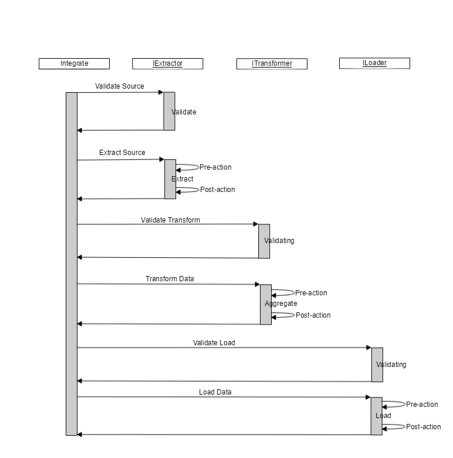

# Extraction: 

Involves extracting data from homogeneous or heterogeneous sources 

# Transformation: 

Processes data by transforming them into a proper storage format/structure for the purposes of querying and analysis; finally

# Load: 

Describes the insertion of data into the final target database such as an operational data store, a data mart, or a data warehouse.

# 

|      |      |      |
| ---- | ---- | ---- |
|      |      |      |
|      |      |      |
|      |      |      |