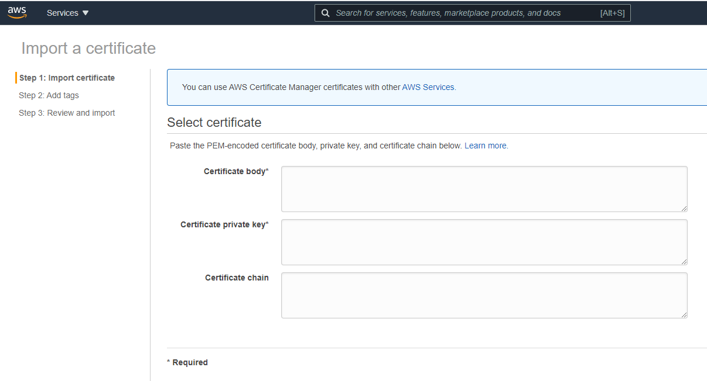
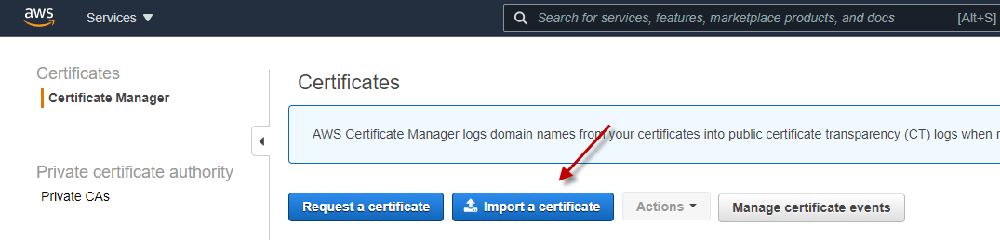
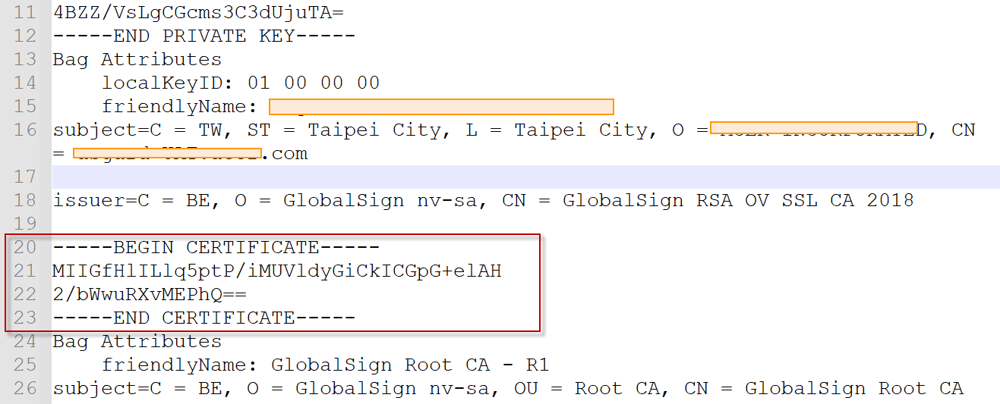
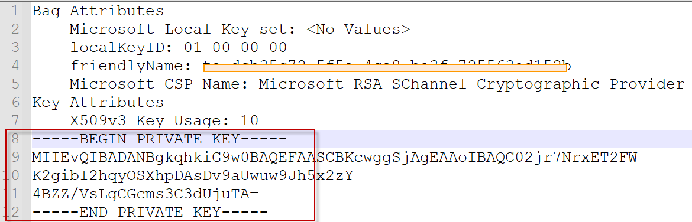
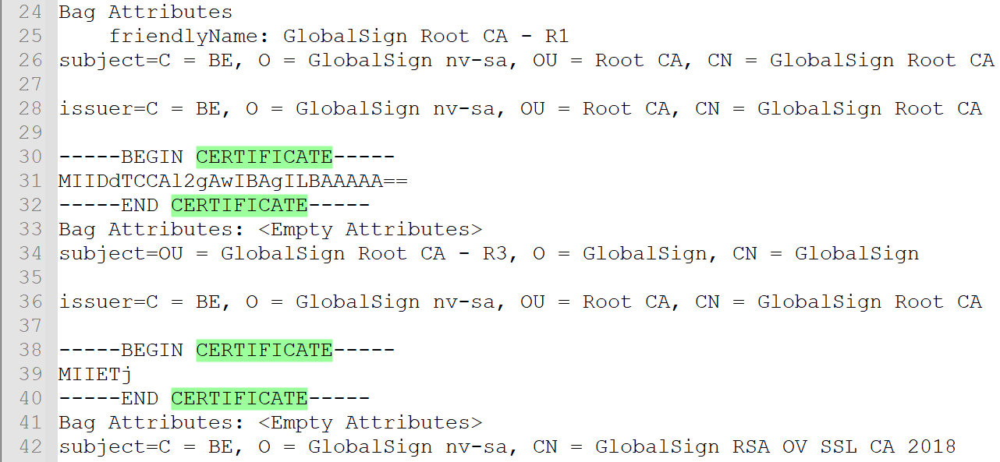
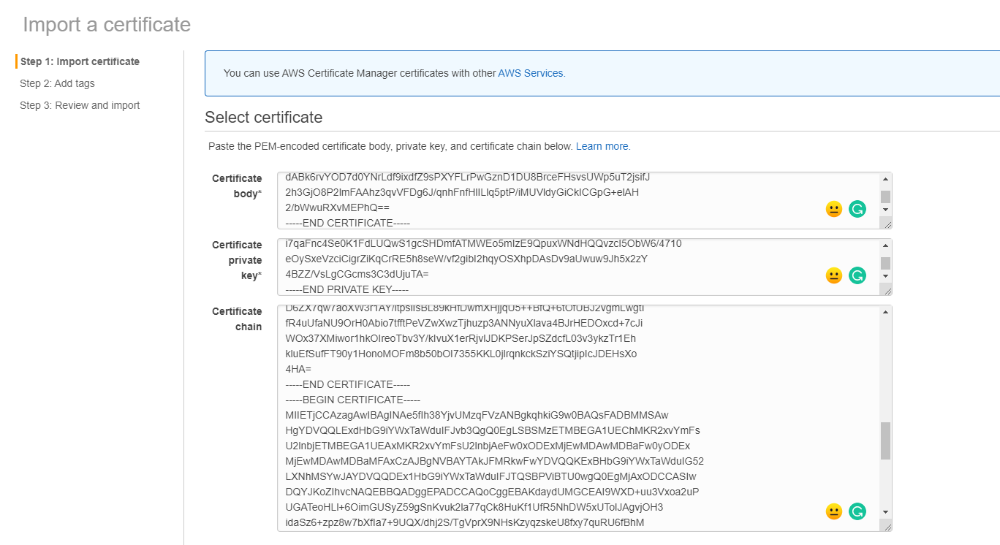

# How to import certificate into ACM and apply-to-ALB

## Preparation: 

- AWS account
- Certificate file with pem format

## Let's go

#### Visit AWS ACM console

1. Click import certificate

   

2. You will see the 3 parts of the attributes need to import: 1. Certificate Body 2. Certificate private key 3. Certificate chain

   

   

3. Open the pem key via text edit application, the first section is Private key. Copy the private key (include the header and footer) to private key field.

   

   

4. The first certificate section is your domain's certificate. Copy this certificate body into the text field

   

   

5. Rests of the certificate are the higher levels certificate. They are also the certificate chain. Copy those certificates and combine them as single text and paste into Certificate chain field.

   

   

6. Click Next then you did it.

   

   

   

