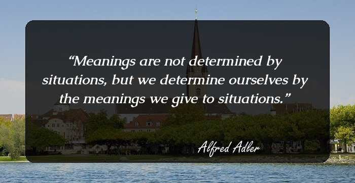

- [How to let AWS S3 serve static content](https://tech-docs.echo-lagom.com/How-to-let-AWS-S3-serve-static-content/index.html)
- [How-to-import-certificate-into-AWS-ACM-and-apply-to-ALB](https://tech-docs.echo-lagom.com/How-to-import-certificate-into-AWS-ACM-and-apply-to-ALB/index.html)

